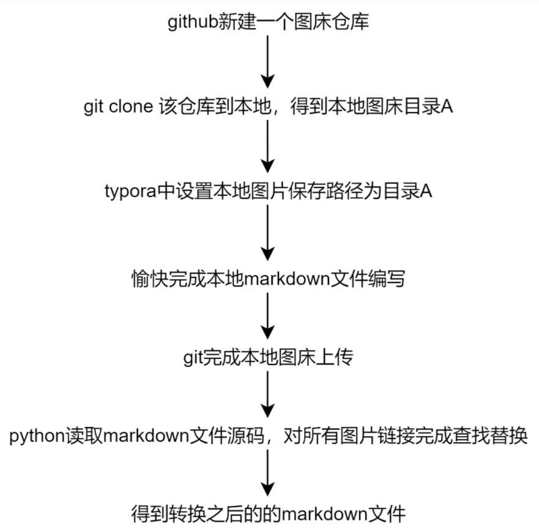

# 论文测试 To 知乎

## 关于这份主题

我希望找到一个比较好的主题，然后能够方便我编写一些论文的理解，并且将其发布在知乎等平台上，这样能督促并加深自己对一些内容的理解。

I hope I can find some good themes for markdown, which make me easier to write down my understanding of some papers and I can easily publish it on some platforms such as zhihu. I believe this can encourage me to read more and deeper to some degree.

## Latex 语法支持

$$
  |\vec{A}|=\sqrt{A_x^2 + A_y^2 + A_z^2}.
$$

## 代码块支持
```python
import torch
torch.cuda_avaliable()
```

## 关于图片

我们采用的是本地图床+github在线访问的方式，即将图片存放在markdown文件同位置下的assets文件夹中，使用相对路径；在发表在网络中时，利用一定的脚本对markdown中的图片链接进行全替换为github中的链接，从而达到效果。



所以需要做到实时同步github，我们可以使用crontab命令进行实时检测仓库变动；

其次是要做到能够替换相应的链接，这里贴出代码

```python
# coding:utf-8
import os
import argparse

# 线上线下图床位置已经确定不变
path_offline = r"E:\我的坚果云\我的坚果云\博客图床\One-click-picgo\imgs" + '\\' # 本地图床目录
path_online = "https://raw.githubusercontent.com/your_github_id/repo_name/master/imgs/" # 线上图床目录

path_out = 'notes/' # 转换完成后的md文件保存路径
if not os.path.exists(path_out):
    os.mkdir(path_out)

ap = argparse.ArgumentParser()
ap.add_argument("-p", "--path", help="the path of your md file")

if __name__ == '__main__':
    args = ap.parse_args()
    path_md = args.path

    # 被处理的md文件可以和本py文件处于同一目录，也可以处于py文件的下一级文件夹内
    if '\\' in path_md:
        folder, name = path_md.split('\\')
    else:
        name = path_md
    path_out_md = "notes\\" + name
    print("在线版markdown文件生成在目录：", path_out_md)

    with open(path_md, 'r', encoding='utf-8') as f: # 需要手动指定解码的格式
        lines = f.readlines()

    out = [l.replace(path_offline, path_online) for l in lines]

    with open(path_out_md, 'w', encoding='utf-8') as f:
        f.writelines(out)
```

